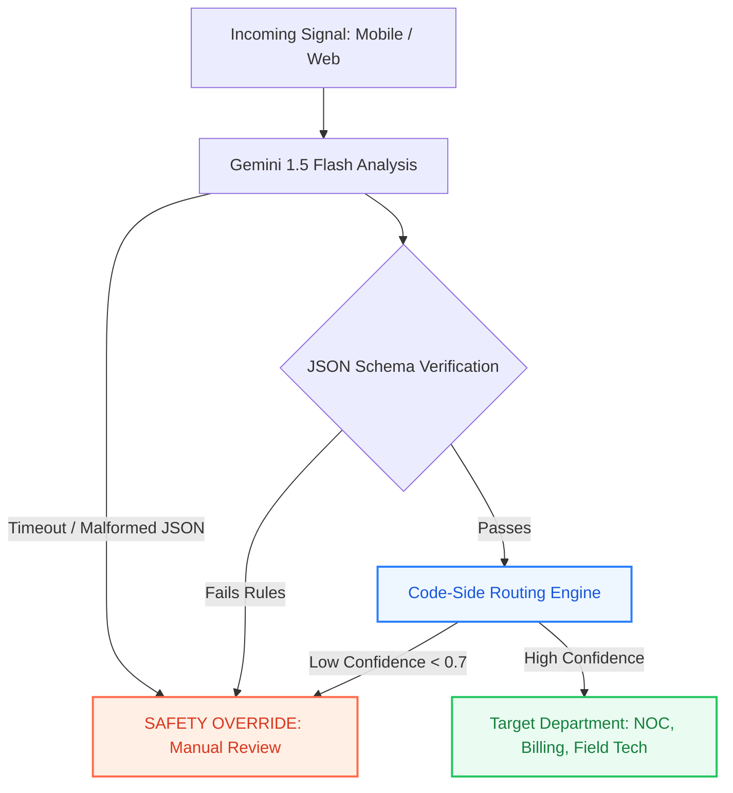

# SignalBridge — Autonomous Infrastructure & Telecom Signal Router

SignalBridge is an enterprise-grade signal triage and incident routing platform designed for large-scale civic and telecommunications infrastructure (DemoTel Baku context). It combines multi-modal ingestion with strict code-side deterministic routing, ensuring automated efficiency while eliminating non-deterministic LLM routing errors.

---

## 🔗 Live Deployment & Repository

- **Live Production URL:** [https://signalbridge-psi.vercel.app/](https://signalbridge-psi.vercel.app/)
- **GitHub Repository:** [https://github.com/Efsann/signalbridge](https://github.com/Efsann/signalbridge)

---

## 🌟 Key Features

- **Multi-Channel Signal Ingestion:** Collects incident signals across Mobile App Chat, Web Portal, and Voice Transcriptions[cite: 2].
- **Gemini 1.5 Flash Triage Engine:** Performs real-time sentiment extraction, department categorization, severity ranking, and confidence scoring.
- **Deterministic Code-Side Routing:** Final routing decisions are strictly executed via rule-based software logic—never blindly delegated to generative AI outputs[cite: 2].
- **Safety Fallback & Circuit Breaker:** In cases of API rate limiting (429), quota exhaustion, or schema drift, the system automatically redirects to an audit-logged `Manual Review` queue[cite: 2].
- **Processed Complaints Ledger:** In-memory, compliance-ready immutable signal registry with live metrics and export capabilities[cite: 2].

---

## 🏗️ Architecture & Safety Pipeline

---

## 🛠️ Tech Stack

* **Frontend:** React 18/19, TypeScript, Vite
* **Styling:** Tailwind CSS (v4 via PostCSS), Lucide Icons
* **AI Engine:** Google Gemini 1.5 Flash API
* **Deployment:** Vercel

---

